# Pixel Workbench: screenshots per version

Every release is captured by the builder's release smoke test (`automation/smoke.py --shots`): every page, every info tab and a mobile view. This branch is never deployed by Pages. Newest first.

## [v0.62.0](v0.62.0/)

02/10/2026 · [commit cb730ad](https://github.com/connorturansky-svg/pixel-workbench/commit/cb730ad12f6bcbb6bb99e86a1b904741253e7786) · [issue #40](https://github.com/connorturansky-svg/pixel-workbench/issues/40)

> Room layout objects can now be removed from the inspector, and boxes and field devices start at measured or practical plan sizes. (suggested in #40)

<a href="v0.62.0/01-workspace.png">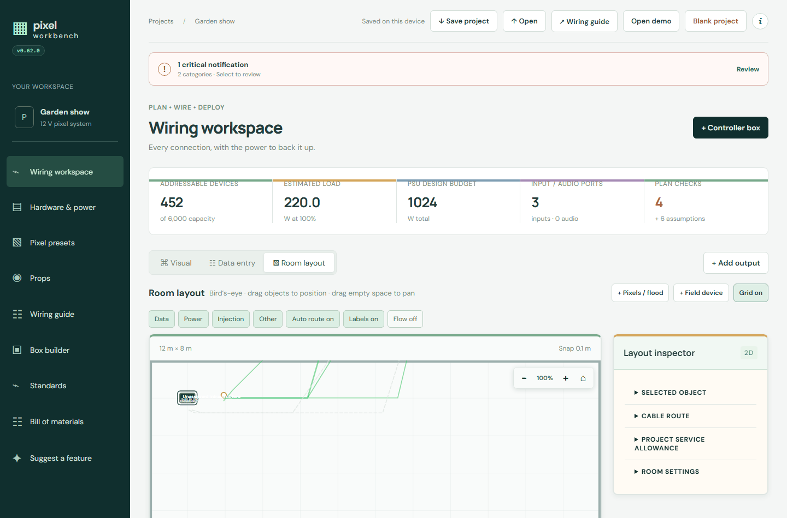</a> <a href="v0.62.0/mobile.png">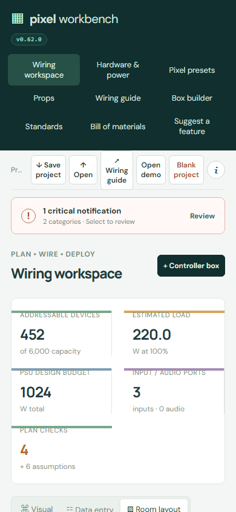</a>

All shots: [workspace](v0.62.0/01-workspace.png) · [hardware](v0.62.0/02-hardware.png) · [presets](v0.62.0/03-presets.png) · [props](v0.62.0/04-props.png) · [guide](v0.62.0/05-guide.png) · [boxes](v0.62.0/06-boxes.png) · [standards](v0.62.0/07-standards.png) · [bom](v0.62.0/08-bom.png) · [suggest](v0.62.0/09-suggest.png) · [info arch](v0.62.0/info-arch.png) · [info how](v0.62.0/info-how.png) · [info keys](v0.62.0/info-keys.png) · [info new](v0.62.0/info-new.png) · [info suggest](v0.62.0/info-suggest.png) · [mobile](v0.62.0/mobile.png)

## [v0.61.0](v0.61.0/)

**Screenshots failed:** gh api -X failed: Post "https://api.github.com/repos/connorturansky-svg/pixel-workbench/git/blobs": read tcp 192.168.0.199:60374->20.26.156.210:443: wsarecv: An existing connection was forcibly closed

## [v0.60.0](v0.60.0/)

02/10/2026 · [commit 74115f4](https://github.com/connorturansky-svg/pixel-workbench/commit/74115f4747ab8c514d155c1c51bfe6fe296a8286) · [issue #39](https://github.com/connorturansky-svg/pixel-workbench/issues/39)

> The Room layout inspector now scrolls and groups its controls into collapsed, toggleable sections. (suggested in #39)

 

All shots: [workspace](v0.60.0/01-workspace.png) · [hardware](v0.60.0/02-hardware.png) · [presets](v0.60.0/03-presets.png) · [props](v0.60.0/04-props.png) · [guide](v0.60.0/05-guide.png) · [boxes](v0.60.0/06-boxes.png) · [standards](v0.60.0/07-standards.png) · [bom](v0.60.0/08-bom.png) · [suggest](v0.60.0/09-suggest.png) · [info arch](v0.60.0/info-arch.png) · [info how](v0.60.0/info-how.png) · [info keys](v0.60.0/info-keys.png) · [info new](v0.60.0/info-new.png) · [info suggest](v0.60.0/info-suggest.png) · [mobile](v0.60.0/mobile.png)

## [v0.59.0](v0.59.0/)

02/10/2026 · [commit df092f6](https://github.com/connorturansky-svg/pixel-workbench/commit/df092f649bb709235c227102e1cbec808bc261f5) · [issue #38](https://github.com/connorturansky-svg/pixel-workbench/issues/38)

> Room plans draw every button-box control as a recognisable push button using its colour from the box builder. (suggested in #38)

 <a href="v0.59.0/mobile.png">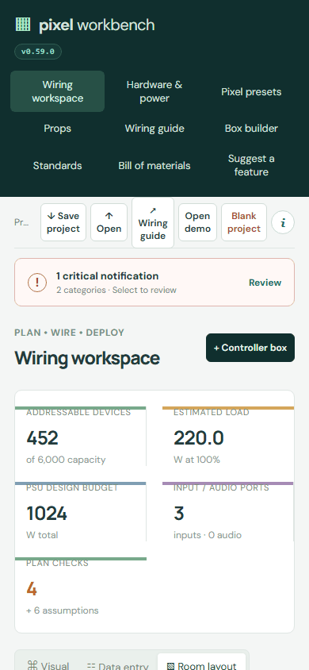</a>

All shots: [workspace](v0.59.0/01-workspace.png) · [hardware](v0.59.0/02-hardware.png) · [presets](v0.59.0/03-presets.png) · [props](v0.59.0/04-props.png) · [guide](v0.59.0/05-guide.png) · [boxes](v0.59.0/06-boxes.png) · [standards](v0.59.0/07-standards.png) · [bom](v0.59.0/08-bom.png) · [suggest](v0.59.0/09-suggest.png) · [info arch](v0.59.0/info-arch.png) · [info how](v0.59.0/info-how.png) · [info keys](v0.59.0/info-keys.png) · [info new](v0.59.0/info-new.png) · [info suggest](v0.59.0/info-suggest.png) · [mobile](v0.59.0/mobile.png)

## [v0.58.0](v0.58.0/)

02/10/2026 · [commit c62a0c0](https://github.com/connorturansky-svg/pixel-workbench/commit/c62a0c0849d7c0530c136929dba49efe2e17f7d9) · [issue #37](https://github.com/connorturansky-svg/pixel-workbench/issues/37)

> Each control in a button box has a colour dropdown, with its selection shown in room plans and itemised in the bill of materials. (suggested in #37)

<a href="v0.58.0/01-workspace.png">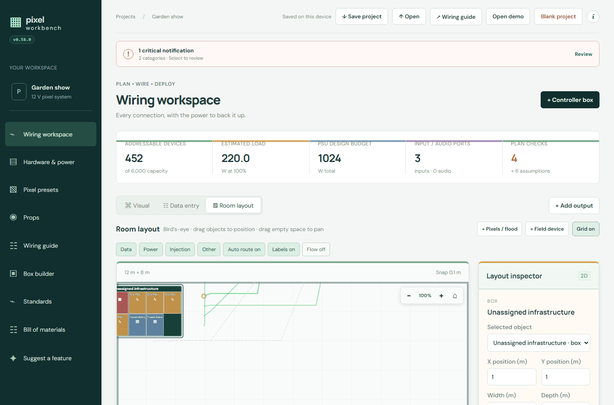</a> 

All shots: [workspace](v0.58.0/01-workspace.png) · [hardware](v0.58.0/02-hardware.png) · [presets](v0.58.0/03-presets.png) · [props](v0.58.0/04-props.png) · [guide](v0.58.0/05-guide.png) · [boxes](v0.58.0/06-boxes.png) · [standards](v0.58.0/07-standards.png) · [bom](v0.58.0/08-bom.png) · [suggest](v0.58.0/09-suggest.png) · [info arch](v0.58.0/info-arch.png) · [info how](v0.58.0/info-how.png) · [info keys](v0.58.0/info-keys.png) · [info new](v0.58.0/info-new.png) · [info suggest](v0.58.0/info-suggest.png) · [mobile](v0.58.0/mobile.png)

## [v0.57.0](v0.57.0/)

02/10/2026 · [commit a6cb85b](https://github.com/connorturansky-svg/pixel-workbench/commit/a6cb85b6524b231fa80948298a107f50e0566912) · [issue #36](https://github.com/connorturansky-svg/pixel-workbench/issues/36)

> Box schematics prevent component overlap and use type-coloured edge connections that route around components and their text. (suggested in #36)

 <a href="v0.57.0/mobile.png">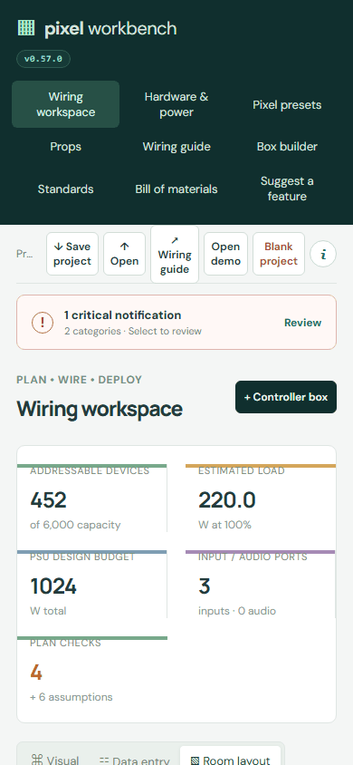</a>

All shots: [workspace](v0.57.0/01-workspace.png) · [hardware](v0.57.0/02-hardware.png) · [presets](v0.57.0/03-presets.png) · [props](v0.57.0/04-props.png) · [guide](v0.57.0/05-guide.png) · [boxes](v0.57.0/06-boxes.png) · [standards](v0.57.0/07-standards.png) · [bom](v0.57.0/08-bom.png) · [suggest](v0.57.0/09-suggest.png) · [info arch](v0.57.0/info-arch.png) · [info how](v0.57.0/info-how.png) · [info keys](v0.57.0/info-keys.png) · [info new](v0.57.0/info-new.png) · [info suggest](v0.57.0/info-suggest.png) · [mobile](v0.57.0/mobile.png)

## [v0.56.0](v0.56.0/)

02/10/2026 · [commit 42aa25c](https://github.com/connorturansky-svg/pixel-workbench/commit/42aa25c5c4f52592f008dad2af82431e54fd27f8) · [issue #34](https://github.com/connorturansky-svg/pixel-workbench/issues/34)

> BaldrickInput8 now supplies its two pixel outputs, room pixels can be placed before connection with a visible warning, and top statistics include controller-box pixel, PSU, input and audio capacity. (follow-up to #34)

 

All shots: [workspace](v0.56.0/01-workspace.png) · [hardware](v0.56.0/02-hardware.png) · [presets](v0.56.0/03-presets.png) · [props](v0.56.0/04-props.png) · [guide](v0.56.0/05-guide.png) · [boxes](v0.56.0/06-boxes.png) · [standards](v0.56.0/07-standards.png) · [bom](v0.56.0/08-bom.png) · [suggest](v0.56.0/09-suggest.png) · [info arch](v0.56.0/info-arch.png) · [info how](v0.56.0/info-how.png) · [info keys](v0.56.0/info-keys.png) · [info new](v0.56.0/info-new.png) · [info suggest](v0.56.0/info-suggest.png) · [mobile](v0.56.0/mobile.png)

## [v0.55.0](v0.55.0/)

02/10/2026 · [commit 01a47d8](https://github.com/connorturansky-svg/pixel-workbench/commit/01a47d8e9e616ef3d24ac5bbd08d98b7bbef9f62) · [issue #35](https://github.com/connorturansky-svg/pixel-workbench/issues/35)

> Room layout uses lighter compact labels, evenly spaces visible box ports and routes cables around controls and their labels with fewer turns. (suggested in #35)

 

All shots: [workspace](v0.55.0/01-workspace.png) · [hardware](v0.55.0/02-hardware.png) · [presets](v0.55.0/03-presets.png) · [props](v0.55.0/04-props.png) · [guide](v0.55.0/05-guide.png) · [boxes](v0.55.0/06-boxes.png) · [standards](v0.55.0/07-standards.png) · [bom](v0.55.0/08-bom.png) · [suggest](v0.55.0/09-suggest.png) · [info arch](v0.55.0/info-arch.png) · [info how](v0.55.0/info-how.png) · [info keys](v0.55.0/info-keys.png) · [info new](v0.55.0/info-new.png) · [info suggest](v0.55.0/info-suggest.png) · [mobile](v0.55.0/mobile.png)

## [v0.54.0](v0.54.0/)

02/10/2026 · [commit 53eac16](https://github.com/connorturansky-svg/pixel-workbench/commit/53eac16fc7ffe07662fa2491d1057e9b7bce6114) · [issue #34](https://github.com/connorturansky-svg/pixel-workbench/issues/34)

> Baldrick8 and Baldrick17 controllers added directly inside a controller box now provide usable pixel outputs for room floods, strings and props. (suggested in #34)

 

All shots: [workspace](v0.54.0/01-workspace.png) · [hardware](v0.54.0/02-hardware.png) · [presets](v0.54.0/03-presets.png) · [props](v0.54.0/04-props.png) · [guide](v0.54.0/05-guide.png) · [boxes](v0.54.0/06-boxes.png) · [standards](v0.54.0/07-standards.png) · [bom](v0.54.0/08-bom.png) · [suggest](v0.54.0/09-suggest.png) · [info arch](v0.54.0/info-arch.png) · [info how](v0.54.0/info-how.png) · [info keys](v0.54.0/info-keys.png) · [info new](v0.54.0/info-new.png) · [info suggest](v0.54.0/info-suggest.png) · [mobile](v0.54.0/mobile.png)

## [v0.53.0](v0.53.0/)

02/10/2026 · [commit fb16185](https://github.com/connorturansky-svg/pixel-workbench/commit/fb1618550686de3d0a1e7487fa8dec134aec40c5) · [issue #29](https://github.com/connorturansky-svg/pixel-workbench/issues/29)

> Box builder now separates controller and button-box tools, with custom 1–5 button enclosures, individual ports and Small, Medium or Large controls. (follow-up to #29)

 <a href="v0.53.0/mobile.png">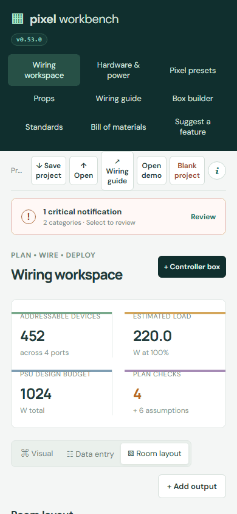</a>

All shots: [workspace](v0.53.0/01-workspace.png) · [hardware](v0.53.0/02-hardware.png) · [presets](v0.53.0/03-presets.png) · [props](v0.53.0/04-props.png) · [guide](v0.53.0/05-guide.png) · [boxes](v0.53.0/06-boxes.png) · [standards](v0.53.0/07-standards.png) · [bom](v0.53.0/08-bom.png) · [suggest](v0.53.0/09-suggest.png) · [info arch](v0.53.0/info-arch.png) · [info how](v0.53.0/info-how.png) · [info keys](v0.53.0/info-keys.png) · [info new](v0.53.0/info-new.png) · [info suggest](v0.53.0/info-suggest.png) · [mobile](v0.53.0/mobile.png)

## [v0.52.0](v0.52.0/)

02/10/2026 · [commit 0345e3e](https://github.com/connorturansky-svg/pixel-workbench/commit/0345e3e72f3a363016ba95b4c9c10fefd21ff8df) · [issue #33](https://github.com/connorturansky-svg/pixel-workbench/issues/33)

> Room layout now uses one controller-box title, labelled pill-shaped edge ports, port-matched cable colours and button endpoints that meet the visible symbol. (suggested in #33)

 

All shots: [workspace](v0.52.0/01-workspace.png) · [hardware](v0.52.0/02-hardware.png) · [presets](v0.52.0/03-presets.png) · [props](v0.52.0/04-props.png) · [guide](v0.52.0/05-guide.png) · [boxes](v0.52.0/06-boxes.png) · [standards](v0.52.0/07-standards.png) · [bom](v0.52.0/08-bom.png) · [suggest](v0.52.0/09-suggest.png) · [info arch](v0.52.0/info-arch.png) · [info how](v0.52.0/info-how.png) · [info keys](v0.52.0/info-keys.png) · [info new](v0.52.0/info-new.png) · [info suggest](v0.52.0/info-suggest.png) · [mobile](v0.52.0/mobile.png)

## [v0.51.0](v0.51.0/)

02/10/2026 · [commit ad6a498](https://github.com/connorturansky-svg/pixel-workbench/commit/ad6a498a0fc13ec30d91c6fa65a08aec184e40a8) · [issue #32](https://github.com/connorturansky-svg/pixel-workbench/issues/32)

> Controller-box schematics now open on a larger scrollable canvas, keeping labels readable while leaving more space between components. (suggested in #32)

 

All shots: [workspace](v0.51.0/01-workspace.png) · [hardware](v0.51.0/02-hardware.png) · [presets](v0.51.0/03-presets.png) · [props](v0.51.0/04-props.png) · [guide](v0.51.0/05-guide.png) · [boxes](v0.51.0/06-boxes.png) · [standards](v0.51.0/07-standards.png) · [bom](v0.51.0/08-bom.png) · [suggest](v0.51.0/09-suggest.png) · [info arch](v0.51.0/info-arch.png) · [info how](v0.51.0/info-how.png) · [info keys](v0.51.0/info-keys.png) · [info new](v0.51.0/info-new.png) · [info suggest](v0.51.0/info-suggest.png) · [mobile](v0.51.0/mobile.png)

## [v0.50.0](v0.50.0/)

02/10/2026 · [commit 9dea522](https://github.com/connorturansky-svg/pixel-workbench/commit/9dea52206a9bf5277985bf9da89fc98e78e63646) · [issue #31](https://github.com/connorturansky-svg/pixel-workbench/issues/31)

> Pixel strings, individual floods, saved presets and prop models can now be added directly from Room layout. (suggested in #31)

 

All shots: [workspace](v0.50.0/01-workspace.png) · [hardware](v0.50.0/02-hardware.png) · [presets](v0.50.0/03-presets.png) · [props](v0.50.0/04-props.png) · [guide](v0.50.0/05-guide.png) · [boxes](v0.50.0/06-boxes.png) · [standards](v0.50.0/07-standards.png) · [bom](v0.50.0/08-bom.png) · [suggest](v0.50.0/09-suggest.png) · [info arch](v0.50.0/info-arch.png) · [info how](v0.50.0/info-how.png) · [info keys](v0.50.0/info-keys.png) · [info new](v0.50.0/info-new.png) · [info suggest](v0.50.0/info-suggest.png) · [mobile](v0.50.0/mobile.png)

## [v0.49.0](v0.49.0/)

02/10/2026 · [commit 2294387](https://github.com/connorturansky-svg/pixel-workbench/commit/229438788bdc0aefe1d3cd692fd1e109a1a59437) · [issue #30](https://github.com/connorturansky-svg/pixel-workbench/issues/30)

> Inactive box edge ports are now hidden from the controller-box schematic, leaving only activated route targets around the layout. (suggested in #30)

<a href="v0.49.0/01-workspace.png">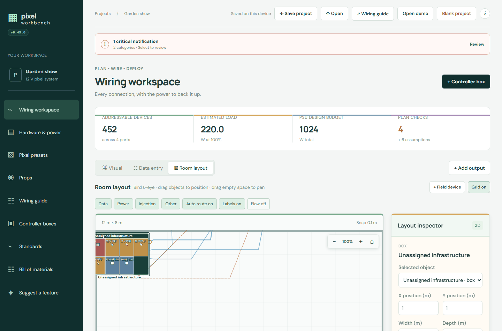</a> 

All shots: [workspace](v0.49.0/01-workspace.png) · [hardware](v0.49.0/02-hardware.png) · [presets](v0.49.0/03-presets.png) · [props](v0.49.0/04-props.png) · [guide](v0.49.0/05-guide.png) · [boxes](v0.49.0/06-boxes.png) · [standards](v0.49.0/07-standards.png) · [bom](v0.49.0/08-bom.png) · [suggest](v0.49.0/09-suggest.png) · [info arch](v0.49.0/info-arch.png) · [info how](v0.49.0/info-how.png) · [info keys](v0.49.0/info-keys.png) · [info new](v0.49.0/info-new.png) · [info suggest](v0.49.0/info-suggest.png) · [mobile](v0.49.0/mobile.png)

## [v0.48.0](v0.48.0/)

02/10/2026 · [commit 20276dd](https://github.com/connorturansky-svg/pixel-workbench/commit/20276dd26bdf44a484cb0dc2368ce98971a1b785) · [issue #30](https://github.com/connorturansky-svg/pixel-workbench/issues/30)

> Disabled controller-box edge ports are now hidden from the schematic while remaining available in the edge-port editor. (suggested in #30)

 <a href="v0.48.0/mobile.png">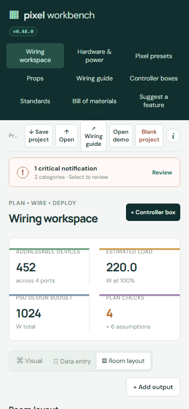</a>

All shots: [workspace](v0.48.0/01-workspace.png) · [hardware](v0.48.0/02-hardware.png) · [presets](v0.48.0/03-presets.png) · [props](v0.48.0/04-props.png) · [guide](v0.48.0/05-guide.png) · [boxes](v0.48.0/06-boxes.png) · [standards](v0.48.0/07-standards.png) · [bom](v0.48.0/08-bom.png) · [suggest](v0.48.0/09-suggest.png) · [info arch](v0.48.0/info-arch.png) · [info how](v0.48.0/info-how.png) · [info keys](v0.48.0/info-keys.png) · [info new](v0.48.0/info-new.png) · [info suggest](v0.48.0/info-suggest.png) · [mobile](v0.48.0/mobile.png)

## [v0.47.0](v0.47.0/)

02/10/2026 · [commit fecc21c](https://github.com/connorturansky-svg/pixel-workbench/commit/fecc21cae611ce69532391fc7e2f0b6f756024b3) · [issue #26](https://github.com/connorturansky-svg/pixel-workbench/issues/26)

> Distinct accent colours, stronger borders and softly tinted work areas now separate summaries, editors, inspectors and card groups across the planning tools. (follow-up to #26)

<a href="v0.47.0/01-workspace.png">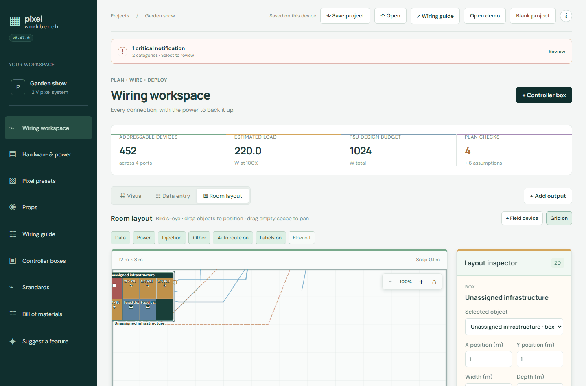</a> 

All shots: [workspace](v0.47.0/01-workspace.png) · [hardware](v0.47.0/02-hardware.png) · [presets](v0.47.0/03-presets.png) · [props](v0.47.0/04-props.png) · [guide](v0.47.0/05-guide.png) · [boxes](v0.47.0/06-boxes.png) · [standards](v0.47.0/07-standards.png) · [bom](v0.47.0/08-bom.png) · [suggest](v0.47.0/09-suggest.png) · [info arch](v0.47.0/info-arch.png) · [info how](v0.47.0/info-how.png) · [info keys](v0.47.0/info-keys.png) · [info new](v0.47.0/info-new.png) · [info suggest](v0.47.0/info-suggest.png) · [mobile](v0.47.0/mobile.png)

## [v0.46.0](v0.46.0/)

02/10/2026 · [commit f63b551](https://github.com/connorturansky-svg/pixel-workbench/commit/f63b55190bdbab16680647ef35085c495fdef306) · [issue #29](https://github.com/connorturansky-svg/pixel-workbench/issues/29)

> Room-layout buttons now have a colour selector, carry that colour into the bill of materials and show their connected box port beneath the device name. (suggested in #29)

 

All shots: [workspace](v0.46.0/01-workspace.png) · [hardware](v0.46.0/02-hardware.png) · [presets](v0.46.0/03-presets.png) · [props](v0.46.0/04-props.png) · [guide](v0.46.0/05-guide.png) · [boxes](v0.46.0/06-boxes.png) · [standards](v0.46.0/07-standards.png) · [bom](v0.46.0/08-bom.png) · [suggest](v0.46.0/09-suggest.png) · [info arch](v0.46.0/info-arch.png) · [info how](v0.46.0/info-how.png) · [info keys](v0.46.0/info-keys.png) · [info new](v0.46.0/info-new.png) · [info suggest](v0.46.0/info-suggest.png) · [mobile](v0.46.0/mobile.png)

## [v0.45.0](v0.45.0/)

02/10/2026 · [commit 17b149b](https://github.com/connorturansky-svg/pixel-workbench/commit/17b149b4c0e31db263c6cc0e4190a9e55d3ce705) · [issue #28](https://github.com/connorturansky-svg/pixel-workbench/issues/28)

> Room layout controller boxes now use compact component names with their icons, shorter edge-port labels and colour-coded port-type rings while retaining full details on hover. (suggested in #28)

 <a href="v0.45.0/mobile.png">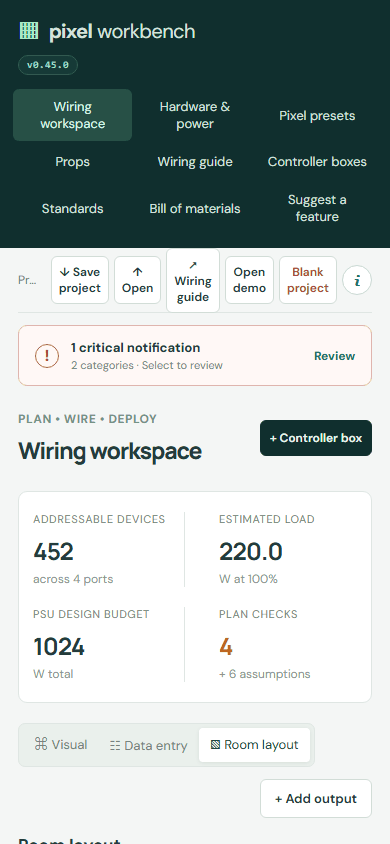</a>

All shots: [workspace](v0.45.0/01-workspace.png) · [hardware](v0.45.0/02-hardware.png) · [presets](v0.45.0/03-presets.png) · [props](v0.45.0/04-props.png) · [guide](v0.45.0/05-guide.png) · [boxes](v0.45.0/06-boxes.png) · [standards](v0.45.0/07-standards.png) · [bom](v0.45.0/08-bom.png) · [suggest](v0.45.0/09-suggest.png) · [info arch](v0.45.0/info-arch.png) · [info how](v0.45.0/info-how.png) · [info keys](v0.45.0/info-keys.png) · [info new](v0.45.0/info-new.png) · [info suggest](v0.45.0/info-suggest.png) · [mobile](v0.45.0/mobile.png)

## [v0.44.0](v0.44.0/)

02/10/2026 · [commit 0c27dbd](https://github.com/connorturansky-svg/pixel-workbench/commit/0c27dbd1873e78c6443a9203334c9c9ef6e6ed79) · [issue #26](https://github.com/connorturansky-svg/pixel-workbench/issues/26)

> Long text and data panels now scroll independently, useful headings can collapse, and stronger colour accents and borders make each section easier to scan. (suggested in #26)

 

All shots: [workspace](v0.44.0/01-workspace.png) · [hardware](v0.44.0/02-hardware.png) · [presets](v0.44.0/03-presets.png) · [props](v0.44.0/04-props.png) · [guide](v0.44.0/05-guide.png) · [boxes](v0.44.0/06-boxes.png) · [standards](v0.44.0/07-standards.png) · [bom](v0.44.0/08-bom.png) · [suggest](v0.44.0/09-suggest.png) · [info arch](v0.44.0/info-arch.png) · [info how](v0.44.0/info-how.png) · [info keys](v0.44.0/info-keys.png) · [info new](v0.44.0/info-new.png) · [info suggest](v0.44.0/info-suggest.png) · [mobile](v0.44.0/mobile.png)

## [v0.43.0](v0.43.0/)

02/10/2026 · [commit 2c3c84f](https://github.com/connorturansky-svg/pixel-workbench/commit/2c3c84fd1eca4008f105b46639f29db7934e7ecb) · [issue #27](https://github.com/connorturansky-svg/pixel-workbench/issues/27)

> Controller-box edge ports now keep their labels inside the schematic and use the matching component-standard colour. (suggested in #27)

 

All shots: [workspace](v0.43.0/01-workspace.png) · [hardware](v0.43.0/02-hardware.png) · [presets](v0.43.0/03-presets.png) · [props](v0.43.0/04-props.png) · [guide](v0.43.0/05-guide.png) · [boxes](v0.43.0/06-boxes.png) · [standards](v0.43.0/07-standards.png) · [bom](v0.43.0/08-bom.png) · [suggest](v0.43.0/09-suggest.png) · [info arch](v0.43.0/info-arch.png) · [info how](v0.43.0/info-how.png) · [info keys](v0.43.0/info-keys.png) · [info new](v0.43.0/info-new.png) · [info suggest](v0.43.0/info-suggest.png) · [mobile](v0.43.0/mobile.png)

## [v0.42.0](v0.42.0/)

02/10/2026 · [commit c289ae4](https://github.com/connorturansky-svg/pixel-workbench/commit/c289ae4b98ff219caba1f4fa0a6c9b43c0ece48c) · [issue #25](https://github.com/connorturansky-svg/pixel-workbench/issues/25)

> Each controller box can now sync changed hardware names, colours, ports and other component standards while keeping its layout and connections. (suggested in #25)

 

All shots: [workspace](v0.42.0/01-workspace.png) · [hardware](v0.42.0/02-hardware.png) · [presets](v0.42.0/03-presets.png) · [props](v0.42.0/04-props.png) · [guide](v0.42.0/05-guide.png) · [boxes](v0.42.0/06-boxes.png) · [standards](v0.42.0/07-standards.png) · [bom](v0.42.0/08-bom.png) · [suggest](v0.42.0/09-suggest.png) · [info arch](v0.42.0/info-arch.png) · [info how](v0.42.0/info-how.png) · [info keys](v0.42.0/info-keys.png) · [info new](v0.42.0/info-new.png) · [info suggest](v0.42.0/info-suggest.png) · [mobile](v0.42.0/mobile.png)

## [v0.41.0](v0.41.0/)

02/10/2026 · [commit 66cc424](https://github.com/connorturansky-svg/pixel-workbench/commit/66cc424cd05dfc548bfde79d2008942846d02e20)

> Suggest a feature now shows the total AI credits, estimated cost, tokens and builds from the last 28 days, just above the Daily build allowance meter.

 

All shots: [workspace](v0.41.0/01-workspace.png) · [hardware](v0.41.0/02-hardware.png) · [presets](v0.41.0/03-presets.png) · [props](v0.41.0/04-props.png) · [guide](v0.41.0/05-guide.png) · [boxes](v0.41.0/06-boxes.png) · [standards](v0.41.0/07-standards.png) · [bom](v0.41.0/08-bom.png) · [suggest](v0.41.0/09-suggest.png) · [info arch](v0.41.0/info-arch.png) · [info how](v0.41.0/info-how.png) · [info keys](v0.41.0/info-keys.png) · [info new](v0.41.0/info-new.png) · [info suggest](v0.41.0/info-suggest.png) · [mobile](v0.41.0/mobile.png)

## [v0.40.0](v0.40.0/)

02/10/2026 · [commit 8364a9a](https://github.com/connorturansky-svg/pixel-workbench/commit/8364a9a9916dde783363f3ffc3b4855635c7e617) · [issue #21](https://github.com/connorturansky-svg/pixel-workbench/issues/21)

> Room layout now shows a live cable growing from a controller-box port while it is dragged, with valid field-device and pixel-group destinations highlighted. (follow-up to #21)

 

All shots: [workspace](v0.40.0/01-workspace.png) · [hardware](v0.40.0/02-hardware.png) · [presets](v0.40.0/03-presets.png) · [props](v0.40.0/04-props.png) · [guide](v0.40.0/05-guide.png) · [boxes](v0.40.0/06-boxes.png) · [standards](v0.40.0/07-standards.png) · [bom](v0.40.0/08-bom.png) · [suggest](v0.40.0/09-suggest.png) · [info arch](v0.40.0/info-arch.png) · [info how](v0.40.0/info-how.png) · [info keys](v0.40.0/info-keys.png) · [info new](v0.40.0/info-new.png) · [info suggest](v0.40.0/info-suggest.png) · [mobile](v0.40.0/mobile.png)

## [v0.39.0](v0.39.0/)

02/10/2026 · [commit 93f893a](https://github.com/connorturansky-svg/pixel-workbench/commit/93f893a659b25f83797a01f72ea69d9956d45f6b) · [issue #24](https://github.com/connorturansky-svg/pixel-workbench/issues/24)

> Controller-box schematics now hide the component wire for an inactive edge port until that port is activated. (suggested in #24)

 

All shots: [workspace](v0.39.0/01-workspace.png) · [hardware](v0.39.0/02-hardware.png) · [presets](v0.39.0/03-presets.png) · [props](v0.39.0/04-props.png) · [guide](v0.39.0/05-guide.png) · [boxes](v0.39.0/06-boxes.png) · [standards](v0.39.0/07-standards.png) · [bom](v0.39.0/08-bom.png) · [suggest](v0.39.0/09-suggest.png) · [info arch](v0.39.0/info-arch.png) · [info how](v0.39.0/info-how.png) · [info keys](v0.39.0/info-keys.png) · [info new](v0.39.0/info-new.png) · [info suggest](v0.39.0/info-suggest.png) · [mobile](v0.39.0/mobile.png)

## [v0.38.0](v0.38.0/)

02/10/2026 · [commit 015783e](https://github.com/connorturansky-svg/pixel-workbench/commit/015783e4aa2aa2ec8f55d80dfddd62b88107fb69) · [issue #23](https://github.com/connorturansky-svg/pixel-workbench/issues/23)

> Controller boxes now create an inactive edge port for every component connector, with editable labels and collapsible component groups for activation. (suggested in #23)

<a href="v0.38.0/01-workspace.png">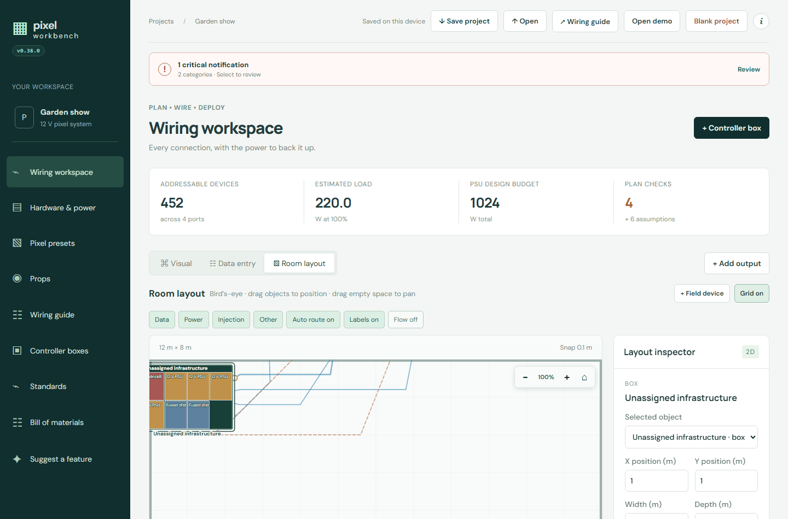</a> 

All shots: [workspace](v0.38.0/01-workspace.png) · [hardware](v0.38.0/02-hardware.png) · [presets](v0.38.0/03-presets.png) · [props](v0.38.0/04-props.png) · [guide](v0.38.0/05-guide.png) · [boxes](v0.38.0/06-boxes.png) · [standards](v0.38.0/07-standards.png) · [bom](v0.38.0/08-bom.png) · [suggest](v0.38.0/09-suggest.png) · [info arch](v0.38.0/info-arch.png) · [info how](v0.38.0/info-how.png) · [info keys](v0.38.0/info-keys.png) · [info new](v0.38.0/info-new.png) · [info suggest](v0.38.0/info-suggest.png) · [mobile](v0.38.0/mobile.png)

## [v0.37.0](v0.37.0/)

02/10/2026 · [commit c8d641b](https://github.com/connorturansky-svg/pixel-workbench/commit/c8d641bd0e05863b2d5384a38d4dc36ad0ec9ffe) · [issue #22](https://github.com/connorturansky-svg/pixel-workbench/issues/22)

> Controller-box schematic zoom now scales component illustrations while keeping the canvas visible, with auto-layout canvas sizing handled separately. (suggested in #22)

 

All shots: [workspace](v0.37.0/01-workspace.png) · [hardware](v0.37.0/02-hardware.png) · [presets](v0.37.0/03-presets.png) · [props](v0.37.0/04-props.png) · [guide](v0.37.0/05-guide.png) · [boxes](v0.37.0/06-boxes.png) · [standards](v0.37.0/07-standards.png) · [bom](v0.37.0/08-bom.png) · [suggest](v0.37.0/09-suggest.png) · [info arch](v0.37.0/info-arch.png) · [info how](v0.37.0/info-how.png) · [info keys](v0.37.0/info-keys.png) · [info new](v0.37.0/info-new.png) · [info suggest](v0.37.0/info-suggest.png) · [mobile](v0.37.0/mobile.png)

## [v0.36.0](v0.36.0/)

02/10/2026 · [commit 9d706c9](https://github.com/connorturansky-svg/pixel-workbench/commit/9d706c9a4d59f653598ef0c62f1430f49660df55) · [issue #21](https://github.com/connorturansky-svg/pixel-workbench/issues/21)

> Room layout now gives buttons, switches, sensors, effects and flood lights recognisable device illustrations, and joins their cables at the nearest edge facing the controller box. (follow-up to #21)

 

All shots: [workspace](v0.36.0/01-workspace.png) · [hardware](v0.36.0/02-hardware.png) · [presets](v0.36.0/03-presets.png) · [props](v0.36.0/04-props.png) · [guide](v0.36.0/05-guide.png) · [boxes](v0.36.0/06-boxes.png) · [standards](v0.36.0/07-standards.png) · [bom](v0.36.0/08-bom.png) · [suggest](v0.36.0/09-suggest.png) · [info arch](v0.36.0/info-arch.png) · [info how](v0.36.0/info-how.png) · [info keys](v0.36.0/info-keys.png) · [info new](v0.36.0/info-new.png) · [info suggest](v0.36.0/info-suggest.png) · [mobile](v0.36.0/mobile.png)

## [v0.35.0](v0.35.0/)

02/10/2026 · [commit 732c239](https://github.com/connorturansky-svg/pixel-workbench/commit/732c239bfd0a87505d30906f0e934bd0848768a2) · [issue #21](https://github.com/connorturansky-svg/pixel-workbench/issues/21)

> The Wiring workspace now shows a glowing live wire while dragging, highlights connected wires and terminals on hover, and illustrates supplies, distribution, controllers and lights with breadboard-style component faces. (suggested in #21)

 

All shots: [workspace](v0.35.0/01-workspace.png) · [hardware](v0.35.0/02-hardware.png) · [presets](v0.35.0/03-presets.png) · [props](v0.35.0/04-props.png) · [guide](v0.35.0/05-guide.png) · [boxes](v0.35.0/06-boxes.png) · [standards](v0.35.0/07-standards.png) · [bom](v0.35.0/08-bom.png) · [suggest](v0.35.0/09-suggest.png) · [info arch](v0.35.0/info-arch.png) · [info how](v0.35.0/info-how.png) · [info keys](v0.35.0/info-keys.png) · [info new](v0.35.0/info-new.png) · [info suggest](v0.35.0/info-suggest.png) · [mobile](v0.35.0/mobile.png)

## [v0.34.0](v0.34.0/)

02/10/2026 · [commit 6a8e400](https://github.com/connorturansky-svg/pixel-workbench/commit/6a8e400b5f1791708469788d6f49ddbd04eeac3d) · [issue #20](https://github.com/connorturansky-svg/pixel-workbench/issues/20)

> Controller-box schematics now have a scrollable zoom canvas and an automatic flow-chart layout that spaces connected components while existing wire routes avoid other parts. (suggested in #20)

 

All shots: [workspace](v0.34.0/01-workspace.png) · [hardware](v0.34.0/02-hardware.png) · [presets](v0.34.0/03-presets.png) · [props](v0.34.0/04-props.png) · [guide](v0.34.0/05-guide.png) · [boxes](v0.34.0/06-boxes.png) · [standards](v0.34.0/07-standards.png) · [bom](v0.34.0/08-bom.png) · [suggest](v0.34.0/09-suggest.png) · [info arch](v0.34.0/info-arch.png) · [info how](v0.34.0/info-how.png) · [info keys](v0.34.0/info-keys.png) · [info new](v0.34.0/info-new.png) · [info suggest](v0.34.0/info-suggest.png) · [mobile](v0.34.0/mobile.png)

## [v0.33.0](v0.33.0/)

02/10/2026 · [commit d77109d](https://github.com/connorturansky-svg/pixel-workbench/commit/d77109d3f59730c0111f36590b7b997a80b577ab) · [issue #19](https://github.com/connorturansky-svg/pixel-workbench/issues/19)

> Controller-box components now offer common Mean Well LRS power-supply and Raspberry Pi size guides that fill the model footprint while keeping dimensions editable. (suggested in #19)

 

All shots: [workspace](v0.33.0/01-workspace.png) · [hardware](v0.33.0/02-hardware.png) · [presets](v0.33.0/03-presets.png) · [props](v0.33.0/04-props.png) · [guide](v0.33.0/05-guide.png) · [boxes](v0.33.0/06-boxes.png) · [standards](v0.33.0/07-standards.png) · [bom](v0.33.0/08-bom.png) · [suggest](v0.33.0/09-suggest.png) · [info arch](v0.33.0/info-arch.png) · [info how](v0.33.0/info-how.png) · [info keys](v0.33.0/info-keys.png) · [info new](v0.33.0/info-new.png) · [info suggest](v0.33.0/info-suggest.png) · [mobile](v0.33.0/mobile.png)

## [v0.32.0](v0.32.0/)

02/10/2026 · [commit f84e0bc](https://github.com/connorturansky-svg/pixel-workbench/commit/f84e0bc32054fc472c73a8fca8464da280e649ab) · [issue #16](https://github.com/connorturansky-svg/pixel-workbench/issues/16)

> Controller-box hardware now includes all documented Baldrick boards with their named power, network, pixel, input, relay and DMX connectors. (suggested in #16)

 

All shots: [workspace](v0.32.0/01-workspace.png) · [hardware](v0.32.0/02-hardware.png) · [presets](v0.32.0/03-presets.png) · [props](v0.32.0/04-props.png) · [guide](v0.32.0/05-guide.png) · [boxes](v0.32.0/06-boxes.png) · [standards](v0.32.0/07-standards.png) · [bom](v0.32.0/08-bom.png) · [suggest](v0.32.0/09-suggest.png) · [info arch](v0.32.0/info-arch.png) · [info how](v0.32.0/info-how.png) · [info keys](v0.32.0/info-keys.png) · [info new](v0.32.0/info-new.png) · [info suggest](v0.32.0/info-suggest.png) · [mobile](v0.32.0/mobile.png)

## [v0.31.0](v0.31.0/)

02/10/2026 · [commit f1ab684](https://github.com/connorturansky-svg/pixel-workbench/commit/f1ab684df813861ba4975d9a05f4c362374f2c24) · [issue #18](https://github.com/connorturansky-svg/pixel-workbench/issues/18)

> A global notification strip now groups electrical checks, room-route faults and controller-box component issues at the top of every page, with links to the relevant workspace. (suggested in #18)

 

All shots: [workspace](v0.31.0/01-workspace.png) · [hardware](v0.31.0/02-hardware.png) · [presets](v0.31.0/03-presets.png) · [props](v0.31.0/04-props.png) · [guide](v0.31.0/05-guide.png) · [boxes](v0.31.0/06-boxes.png) · [standards](v0.31.0/07-standards.png) · [bom](v0.31.0/08-bom.png) · [suggest](v0.31.0/09-suggest.png) · [info arch](v0.31.0/info-arch.png) · [info how](v0.31.0/info-how.png) · [info keys](v0.31.0/info-keys.png) · [info new](v0.31.0/info-new.png) · [info suggest](v0.31.0/info-suggest.png) · [mobile](v0.31.0/mobile.png)

## [v0.30.0](v0.30.0/)

02/10/2026 · [commit 7e33fa7](https://github.com/connorturansky-svg/pixel-workbench/commit/7e33fa734c666155e6d0017f7b423fdc917a76a9) · [issue #17](https://github.com/connorturansky-svg/pixel-workbench/issues/17)

> Controller boxes can now define labelled ports on any enclosure edge, wire component connectors to them and choose which ports appear as route targets in Room layout. (suggested in #17)

 

All shots: [workspace](v0.30.0/01-workspace.png) · [hardware](v0.30.0/02-hardware.png) · [presets](v0.30.0/03-presets.png) · [props](v0.30.0/04-props.png) · [guide](v0.30.0/05-guide.png) · [boxes](v0.30.0/06-boxes.png) · [standards](v0.30.0/07-standards.png) · [bom](v0.30.0/08-bom.png) · [suggest](v0.30.0/09-suggest.png) · [info arch](v0.30.0/info-arch.png) · [info how](v0.30.0/info-how.png) · [info keys](v0.30.0/info-keys.png) · [info new](v0.30.0/info-new.png) · [info suggest](v0.30.0/info-suggest.png) · [mobile](v0.30.0/mobile.png)

## [v0.29.0](v0.29.0/)

02/10/2026 · [commit 93fb94b](https://github.com/connorturansky-svg/pixel-workbench/commit/93fb94b9edf228a9529046c121bcfcfcf7375d87) · [issue #15](https://github.com/connorturansky-svg/pixel-workbench/issues/15)

> Controller-box wiring now follows the pointer while dragging, routes around components where possible, fills ports that are linked and softly highlights both ends when a port or wire is hovered. (suggested in #15)

 

All shots: [workspace](v0.29.0/01-workspace.png) · [hardware](v0.29.0/02-hardware.png) · [presets](v0.29.0/03-presets.png) · [props](v0.29.0/04-props.png) · [guide](v0.29.0/05-guide.png) · [boxes](v0.29.0/06-boxes.png) · [standards](v0.29.0/07-standards.png) · [bom](v0.29.0/08-bom.png) · [suggest](v0.29.0/09-suggest.png) · [info arch](v0.29.0/info-arch.png) · [info how](v0.29.0/info-how.png) · [info keys](v0.29.0/info-keys.png) · [info new](v0.29.0/info-new.png) · [info suggest](v0.29.0/info-suggest.png) · [mobile](v0.29.0/mobile.png)

## [v0.28.0](v0.28.0/)

02/10/2026 · [commit 8fb2968](https://github.com/connorturansky-svg/pixel-workbench/commit/8fb296838292d8b63422e99bd2b161a563bbc08f) · [issue #12](https://github.com/connorturansky-svg/pixel-workbench/issues/12)

> Controller-box schematics now show each component as a basic top-down hardware illustration, with every named port drawn as a colour-coded connector that remains directly wireable. (follow-up to #12)

 

All shots: [workspace](v0.28.0/01-workspace.png) · [hardware](v0.28.0/02-hardware.png) · [presets](v0.28.0/03-presets.png) · [props](v0.28.0/04-props.png) · [guide](v0.28.0/05-guide.png) · [boxes](v0.28.0/06-boxes.png) · [standards](v0.28.0/07-standards.png) · [bom](v0.28.0/08-bom.png) · [suggest](v0.28.0/09-suggest.png) · [info arch](v0.28.0/info-arch.png) · [info how](v0.28.0/info-how.png) · [info keys](v0.28.0/info-keys.png) · [info new](v0.28.0/info-new.png) · [info suggest](v0.28.0/info-suggest.png) · [mobile](v0.28.0/mobile.png)

## [v0.27.0](v0.27.0/)

02/10/2026 · [commit eb95c72](https://github.com/connorturansky-svg/pixel-workbench/commit/eb95c72925dc65a6fb9209467a125da6342af385) · [issue #15](https://github.com/connorturansky-svg/pixel-workbench/issues/15)

> Feature requests now have a Title field. The request number still leads the GitHub issue title, for example “[Feature] #15 Your title”.

<a href="v0.27.0/01-workspace.png">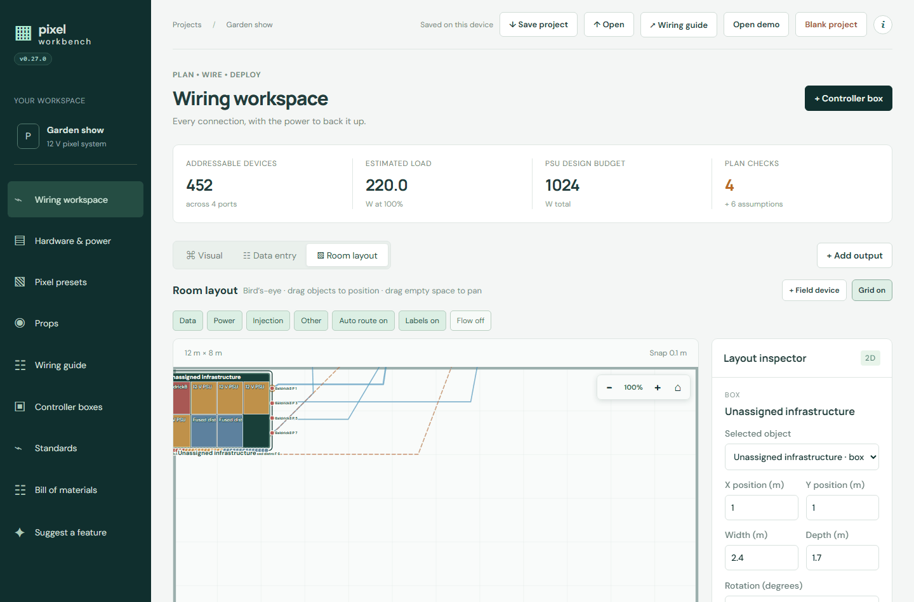</a> 

All shots: [workspace](v0.27.0/01-workspace.png) · [hardware](v0.27.0/02-hardware.png) · [presets](v0.27.0/03-presets.png) · [props](v0.27.0/04-props.png) · [guide](v0.27.0/05-guide.png) · [boxes](v0.27.0/06-boxes.png) · [standards](v0.27.0/07-standards.png) · [bom](v0.27.0/08-bom.png) · [suggest](v0.27.0/09-suggest.png) · [info arch](v0.27.0/info-arch.png) · [info how](v0.27.0/info-how.png) · [info keys](v0.27.0/info-keys.png) · [info new](v0.27.0/info-new.png) · [info suggest](v0.27.0/info-suggest.png) · [mobile](v0.27.0/mobile.png)

## [v0.26.0](v0.26.0/)

02/10/2026 · [commit c556c76](https://github.com/connorturansky-svg/pixel-workbench/commit/c556c76d619e226fbef837e1dd39049057d366cb)

> Automatic feature builds now use fewer AI credits. The app’s code is formatted into short, readable lines, so the build agent reads far less text to find what it needs.

 

All shots: [workspace](v0.26.0/01-workspace.png) · [hardware](v0.26.0/02-hardware.png) · [presets](v0.26.0/03-presets.png) · [props](v0.26.0/04-props.png) · [guide](v0.26.0/05-guide.png) · [boxes](v0.26.0/06-boxes.png) · [standards](v0.26.0/07-standards.png) · [bom](v0.26.0/08-bom.png) · [suggest](v0.26.0/09-suggest.png) · [info arch](v0.26.0/info-arch.png) · [info how](v0.26.0/info-how.png) · [info keys](v0.26.0/info-keys.png) · [info new](v0.26.0/info-new.png) · [mobile](v0.26.0/mobile.png)

## [v0.25.0](v0.25.0/)

02/10/2026 · [commit 2d96284](https://github.com/connorturansky-svg/pixel-workbench/commit/2d9628440875c40e9675f355c2b36988d071089d) · [issue #14](https://github.com/connorturansky-svg/pixel-workbench/issues/14)

> Box details can now be collapsed in the controller-box inspector and close automatically when a component is selected, keeping that component’s controls in view. (suggested in #14)

 

All shots: [workspace](v0.25.0/01-workspace.png) · [hardware](v0.25.0/02-hardware.png) · [presets](v0.25.0/03-presets.png) · [props](v0.25.0/04-props.png) · [guide](v0.25.0/05-guide.png) · [boxes](v0.25.0/06-boxes.png) · [standards](v0.25.0/07-standards.png) · [bom](v0.25.0/08-bom.png) · [suggest](v0.25.0/09-suggest.png) · [info arch](v0.25.0/info-arch.png) · [info how](v0.25.0/info-how.png) · [info keys](v0.25.0/info-keys.png) · [info new](v0.25.0/info-new.png) · [mobile](v0.25.0/mobile.png)

## [v0.24.0](v0.24.0/)

02/10/2026 · [commit 0387fa8](https://github.com/connorturansky-svg/pixel-workbench/commit/0387fa8c6166b2aa10df379b7cd4ba9bd8a9d487) · [issue #12](https://github.com/connorturansky-svg/pixel-workbench/issues/12)

> Controller boxes now use reusable Small, Medium and Large enclosure sizes in centimetres. Custom sizes can be managed in the device-local Standards library, box templates retain their enclosure dimensions, and the Box details panel scrolls independently. (suggested in #12)

 <a href="v0.24.0/mobile.png">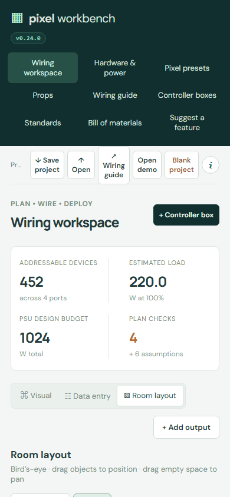</a>

All shots: [workspace](v0.24.0/01-workspace.png) · [hardware](v0.24.0/02-hardware.png) · [presets](v0.24.0/03-presets.png) · [props](v0.24.0/04-props.png) · [guide](v0.24.0/05-guide.png) · [boxes](v0.24.0/06-boxes.png) · [standards](v0.24.0/07-standards.png) · [bom](v0.24.0/08-bom.png) · [suggest](v0.24.0/09-suggest.png) · [info arch](v0.24.0/info-arch.png) · [info how](v0.24.0/info-how.png) · [info keys](v0.24.0/info-keys.png) · [info new](v0.24.0/info-new.png) · [mobile](v0.24.0/mobile.png)

## [v0.23.0](v0.23.0/)

02/10/2026 · [commit b1777c1](https://github.com/connorturansky-svg/pixel-workbench/commit/b1777c1d92d4bdc04d24730d4ca4133ec63760dc) · [issue #11](https://github.com/connorturansky-svg/pixel-workbench/issues/11)

> Each component placed in a controller box can now have its own optional subname, shown beneath the hardware name in box and room layouts. Subnames are retained in reusable box templates. (suggested in #11)

 

All shots: [workspace](v0.23.0/01-workspace.png) · [hardware](v0.23.0/02-hardware.png) · [presets](v0.23.0/03-presets.png) · [props](v0.23.0/04-props.png) · [guide](v0.23.0/05-guide.png) · [boxes](v0.23.0/06-boxes.png) · [standards](v0.23.0/07-standards.png) · [bom](v0.23.0/08-bom.png) · [suggest](v0.23.0/09-suggest.png) · [info arch](v0.23.0/info-arch.png) · [info how](v0.23.0/info-how.png) · [info keys](v0.23.0/info-keys.png) · [info new](v0.23.0/info-new.png) · [mobile](v0.23.0/mobile.png)

## [v0.22.0](v0.22.0/)

02/10/2026 · [commit c371db7](https://github.com/connorturansky-svg/pixel-workbench/commit/c371db7881c04ef5d21e875ed77546694e81be58) · [issue #10](https://github.com/connorturansky-svg/pixel-workbench/issues/10)

> BaldrickInput and BaldrickInput8 are now separate options for project hardware and controller-box plans, with one or eight assignable inputs respectively. (suggested in #10)

 

All shots: [workspace](v0.22.0/01-workspace.png) · [hardware](v0.22.0/02-hardware.png) · [presets](v0.22.0/03-presets.png) · [props](v0.22.0/04-props.png) · [guide](v0.22.0/05-guide.png) · [boxes](v0.22.0/06-boxes.png) · [standards](v0.22.0/07-standards.png) · [bom](v0.22.0/08-bom.png) · [suggest](v0.22.0/09-suggest.png) · [info arch](v0.22.0/info-arch.png) · [info how](v0.22.0/info-how.png) · [info keys](v0.22.0/info-keys.png) · [info new](v0.22.0/info-new.png) · [mobile](v0.22.0/mobile.png)

## [v0.21.0](v0.21.0/)

02/10/2026 · [commit fbd469c](https://github.com/connorturansky-svg/pixel-workbench/commit/fbd469c93d677087c2c48e161705f263c37acf46) · [issue #9](https://github.com/connorturansky-svg/pixel-workbench/issues/9)

> The hardware library now includes a step-down transformer with typed mains-primary and low-voltage AC-secondary ports, plus reminders to verify its electrical ratings and protection. Existing device libraries receive it once. (suggested in #9)

 

All shots: [workspace](v0.21.0/01-workspace.png) · [hardware](v0.21.0/02-hardware.png) · [presets](v0.21.0/03-presets.png) · [props](v0.21.0/04-props.png) · [guide](v0.21.0/05-guide.png) · [boxes](v0.21.0/06-boxes.png) · [standards](v0.21.0/07-standards.png) · [bom](v0.21.0/08-bom.png) · [suggest](v0.21.0/09-suggest.png) · [info arch](v0.21.0/info-arch.png) · [info how](v0.21.0/info-how.png) · [info keys](v0.21.0/info-keys.png) · [info new](v0.21.0/info-new.png) · [mobile](v0.21.0/mobile.png)

## [v0.20.0](v0.20.0/)

02/10/2026 · [commit 6f64a86](https://github.com/connorturansky-svg/pixel-workbench/commit/6f64a860942daa719ecfbed2094a890dc60c7f43)

> Controller boxes now have Schematic and scale Physical layout views, with rotatable component drawings, enclosure bounds, stacking layers and overlap warnings.

<a href="v0.20.0/01-workspace.png">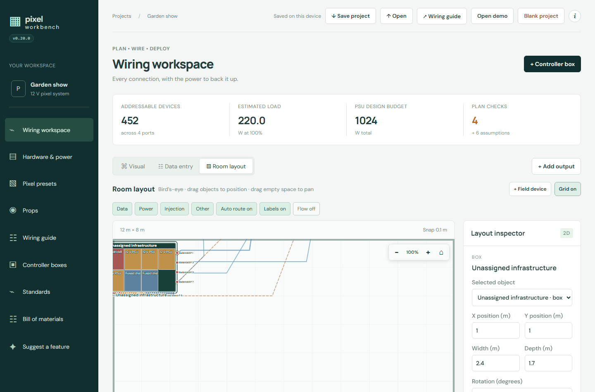</a> 

All shots: [workspace](v0.20.0/01-workspace.png) · [hardware](v0.20.0/02-hardware.png) · [presets](v0.20.0/03-presets.png) · [props](v0.20.0/04-props.png) · [guide](v0.20.0/05-guide.png) · [boxes](v0.20.0/06-boxes.png) · [standards](v0.20.0/07-standards.png) · [bom](v0.20.0/08-bom.png) · [suggest](v0.20.0/09-suggest.png) · [info arch](v0.20.0/info-arch.png) · [info how](v0.20.0/info-how.png) · [info keys](v0.20.0/info-keys.png) · [info new](v0.20.0/info-new.png) · [mobile](v0.20.0/mobile.png)

## [v0.19.0](v0.19.0/)

02/10/2026 · [commit 4cac229](https://github.com/connorturansky-svg/pixel-workbench/commit/4cac2297352179e4624ff19f4985aecb91fab101) · [issue #7](https://github.com/connorturansky-svg/pixel-workbench/issues/7)

> Feature request titles now start with their number, for example “[Feature] #7 …”, on GitHub and in the Suggest a feature list.

 

All shots: [workspace](v0.19.0/01-workspace.png) · [hardware](v0.19.0/02-hardware.png) · [presets](v0.19.0/03-presets.png) · [props](v0.19.0/04-props.png) · [guide](v0.19.0/05-guide.png) · [boxes](v0.19.0/06-boxes.png) · [standards](v0.19.0/07-standards.png) · [bom](v0.19.0/08-bom.png) · [suggest](v0.19.0/09-suggest.png) · [info arch](v0.19.0/info-arch.png) · [info how](v0.19.0/info-how.png) · [info keys](v0.19.0/info-keys.png) · [info new](v0.19.0/info-new.png) · [mobile](v0.19.0/mobile.png)

## [v0.18.0](v0.18.0/)

02/10/2026 · [commit 919e2f0](https://github.com/connorturansky-svg/pixel-workbench/commit/919e2f0a63d960c9b214d5f6dbd995d08fbcac0c) · [issue #8](https://github.com/connorturansky-svg/pixel-workbench/issues/8)

> Cable-route pivots now keep hold of the pointer throughout a room-layout drag, so they can be repositioned reliably like other movable items. (suggested in #8)

 <a href="v0.18.0/mobile.png">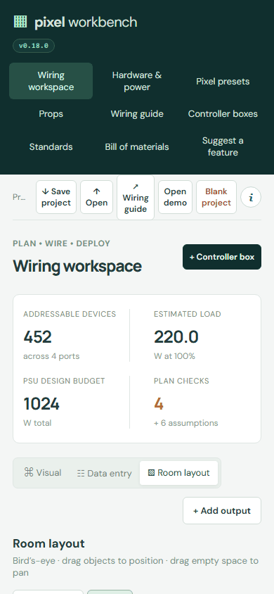</a>

All shots: [workspace](v0.18.0/01-workspace.png) · [hardware](v0.18.0/02-hardware.png) · [presets](v0.18.0/03-presets.png) · [props](v0.18.0/04-props.png) · [guide](v0.18.0/05-guide.png) · [boxes](v0.18.0/06-boxes.png) · [standards](v0.18.0/07-standards.png) · [bom](v0.18.0/08-bom.png) · [suggest](v0.18.0/09-suggest.png) · [info arch](v0.18.0/info-arch.png) · [info how](v0.18.0/info-how.png) · [info keys](v0.18.0/info-keys.png) · [info new](v0.18.0/info-new.png) · [mobile](v0.18.0/mobile.png)

## [v0.17.0](v0.17.0/)

02/10/2026 · [commit bf8a6f9](https://github.com/connorturansky-svg/pixel-workbench/commit/bf8a6f9caf449d3854aa85c3415dcae3d66f30e3)

> Automatic builds now share a daily allowance of 5,000 AI credits across all requests and users, over a rolling 24 hours.

 

All shots: [workspace](v0.17.0/01-workspace.png) · [hardware](v0.17.0/02-hardware.png) · [presets](v0.17.0/03-presets.png) · [props](v0.17.0/04-props.png) · [guide](v0.17.0/05-guide.png) · [boxes](v0.17.0/06-boxes.png) · [standards](v0.17.0/07-standards.png) · [bom](v0.17.0/08-bom.png) · [suggest](v0.17.0/09-suggest.png) · [info arch](v0.17.0/info-arch.png) · [info how](v0.17.0/info-how.png) · [info keys](v0.17.0/info-keys.png) · [info new](v0.17.0/info-new.png) · [mobile](v0.17.0/mobile.png)

## [v0.16.0](v0.16.0/)

02/10/2026 · [commit 2b5e058](https://github.com/connorturansky-svg/pixel-workbench/commit/2b5e058cc7517db89a1d4717c5bc818162df6c95)

> Room labels are larger, sit closer to their objects and scale with the room view; a toolbar control can hide or show all labels.

 

All shots: [workspace](v0.16.0/01-workspace.png) · [hardware](v0.16.0/02-hardware.png) · [presets](v0.16.0/03-presets.png) · [props](v0.16.0/04-props.png) · [guide](v0.16.0/05-guide.png) · [boxes](v0.16.0/06-boxes.png) · [standards](v0.16.0/07-standards.png) · [bom](v0.16.0/08-bom.png) · [suggest](v0.16.0/09-suggest.png) · [info arch](v0.16.0/info-arch.png) · [info how](v0.16.0/info-how.png) · [info keys](v0.16.0/info-keys.png) · [info new](v0.16.0/info-new.png) · [mobile](v0.16.0/mobile.png)

## [v0.15.0](v0.15.0/)

02/10/2026 · [commit fe63e2e](https://github.com/connorturansky-svg/pixel-workbench/commit/fe63e2e557d5dd2258f012ae3803d44a4813801b)

> Requests and build status now tracks AI cost. Each shipped request shows its estimated tokens, AI credits and cost. Hover over it to see the model, the token breakdown and the agent time.

<a href="v0.15.0/01-workspace.png">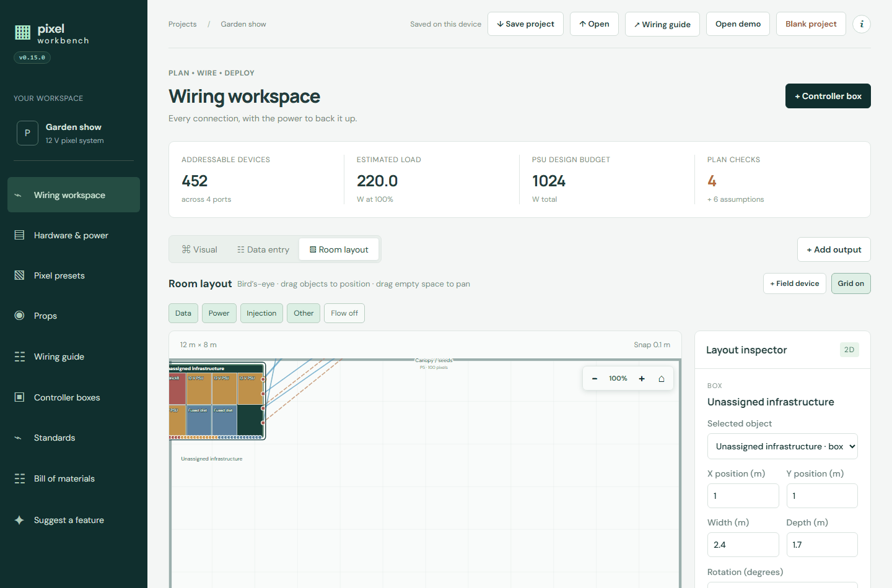</a> 

All shots: [workspace](v0.15.0/01-workspace.png) · [hardware](v0.15.0/02-hardware.png) · [presets](v0.15.0/03-presets.png) · [props](v0.15.0/04-props.png) · [guide](v0.15.0/05-guide.png) · [boxes](v0.15.0/06-boxes.png) · [standards](v0.15.0/07-standards.png) · [bom](v0.15.0/08-bom.png) · [suggest](v0.15.0/09-suggest.png) · [info arch](v0.15.0/info-arch.png) · [info how](v0.15.0/info-how.png) · [info keys](v0.15.0/info-keys.png) · [info new](v0.15.0/info-new.png) · [mobile](v0.15.0/mobile.png)

## [v0.14.0](v0.14.0/)

02/10/2026 · [commit d140d4a](https://github.com/connorturansky-svg/pixel-workbench/commit/d140d4aa4432cdc7d4cb271bd8d96a5232d21c28) · [issue #5](https://github.com/connorturansky-svg/pixel-workbench/issues/5)

> Room layout now supports pointer-centred mouse-wheel zoom, click-and-drag panning on empty space, and corner controls for zooming or returning home. (suggested in #5)

 

All shots: [workspace](v0.14.0/01-workspace.png) · [hardware](v0.14.0/02-hardware.png) · [presets](v0.14.0/03-presets.png) · [props](v0.14.0/04-props.png) · [guide](v0.14.0/05-guide.png) · [boxes](v0.14.0/06-boxes.png) · [standards](v0.14.0/07-standards.png) · [bom](v0.14.0/08-bom.png) · [suggest](v0.14.0/09-suggest.png) · [info arch](v0.14.0/info-arch.png) · [info how](v0.14.0/info-how.png) · [info keys](v0.14.0/info-keys.png) · [info new](v0.14.0/info-new.png) · [mobile](v0.14.0/mobile.png)

## [v0.13.0](v0.13.0/)

02/10/2026 · [commit ea1dc70](https://github.com/connorturansky-svg/pixel-workbench/commit/ea1dc7048a56acc01867426b0f29e69c6ca2e480) · [issue #4](https://github.com/connorturansky-svg/pixel-workbench/issues/4)

> The navigation now wraps on narrow screens and compacts on short screens, so every page remains available without scrolling the navigation. The redundant device-local project label has also been removed. (suggested in #4)

 <a href="v0.13.0/mobile.png">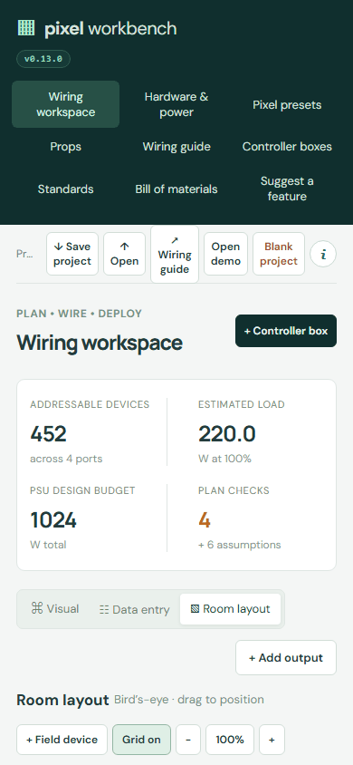</a>

All shots: [workspace](v0.13.0/01-workspace.png) · [hardware](v0.13.0/02-hardware.png) · [presets](v0.13.0/03-presets.png) · [props](v0.13.0/04-props.png) · [guide](v0.13.0/05-guide.png) · [boxes](v0.13.0/06-boxes.png) · [standards](v0.13.0/07-standards.png) · [bom](v0.13.0/08-bom.png) · [suggest](v0.13.0/09-suggest.png) · [info arch](v0.13.0/info-arch.png) · [info how](v0.13.0/info-how.png) · [info keys](v0.13.0/info-keys.png) · [info new](v0.13.0/info-new.png) · [mobile](v0.13.0/mobile.png)

## [v0.12.0](v0.12.0/)

02/10/2026 · [commit f361d04](https://github.com/connorturansky-svg/pixel-workbench/commit/f361d045c66ec086b64f24597e1d62a1fde2d0b2)

> The build stages in Requests and build status are now tabs. Select All, Queued, Building, Tested or Shipped to see the requests at that stage, with a count on each.

 <a href="v0.12.0/mobile.png">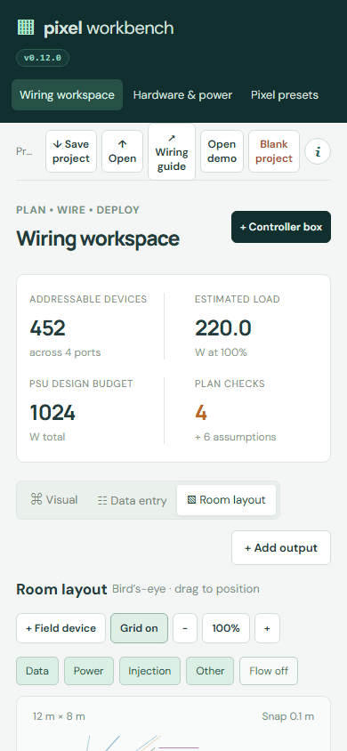</a>

All shots: [workspace](v0.12.0/01-workspace.png) · [hardware](v0.12.0/02-hardware.png) · [presets](v0.12.0/03-presets.png) · [props](v0.12.0/04-props.png) · [guide](v0.12.0/05-guide.png) · [boxes](v0.12.0/06-boxes.png) · [standards](v0.12.0/07-standards.png) · [bom](v0.12.0/08-bom.png) · [suggest](v0.12.0/09-suggest.png) · [info arch](v0.12.0/info-arch.png) · [info how](v0.12.0/info-how.png) · [info keys](v0.12.0/info-keys.png) · [info new](v0.12.0/info-new.png) · [mobile](v0.12.0/mobile.png)

## [v0.11.0](v0.11.0/)

02/10/2026 · [commit 0118d51](https://github.com/connorturansky-svg/pixel-workbench/commit/0118d5100c80a9a4c3eb2f1322a2bc2526325028) · [issue #3](https://github.com/connorturansky-svg/pixel-workbench/issues/3)

> The sidebar is shorter and easier to scan now that project actions appear only in the top bar and the promotional tagline has been removed. (suggested in #3)

 

All shots: [workspace](v0.11.0/01-workspace.png) · [hardware](v0.11.0/02-hardware.png) · [presets](v0.11.0/03-presets.png) · [props](v0.11.0/04-props.png) · [guide](v0.11.0/05-guide.png) · [boxes](v0.11.0/06-boxes.png) · [standards](v0.11.0/07-standards.png) · [bom](v0.11.0/08-bom.png) · [suggest](v0.11.0/09-suggest.png) · [info arch](v0.11.0/info-arch.png) · [info how](v0.11.0/info-how.png) · [info keys](v0.11.0/info-keys.png) · [info new](v0.11.0/info-new.png) · [mobile](v0.11.0/mobile.png)

## [v0.10.0](v0.10.0/)

02/10/2026 · [commit f3ad0e4](https://github.com/connorturansky-svg/pixel-workbench/commit/f3ad0e41d39fcb5e7ea445c48ae95b1f3756d490)

> Suggest a feature now submits from inside the app. Select Submit and the request is filed in the background, with your screenshots attached. GitHub no longer opens in a new tab.

 

All shots: [workspace](v0.10.0/01-workspace.png) · [hardware](v0.10.0/02-hardware.png) · [presets](v0.10.0/03-presets.png) · [props](v0.10.0/04-props.png) · [guide](v0.10.0/05-guide.png) · [boxes](v0.10.0/06-boxes.png) · [standards](v0.10.0/07-standards.png) · [bom](v0.10.0/08-bom.png) · [suggest](v0.10.0/09-suggest.png) · [info arch](v0.10.0/info-arch.png) · [info how](v0.10.0/info-how.png) · [info keys](v0.10.0/info-keys.png) · [info new](v0.10.0/info-new.png) · [mobile](v0.10.0/mobile.png)

## [v0.9.0](v0.9.0/)

02/10/2026 · [commit a35690d](https://github.com/connorturansky-svg/pixel-workbench/commit/a35690dca5c4809ff39b2d467c92fec280cb80d3)

> Shipped feature requests now show the version they were released in, linked to that release on GitHub.

<a href="v0.9.0/01-workspace.png">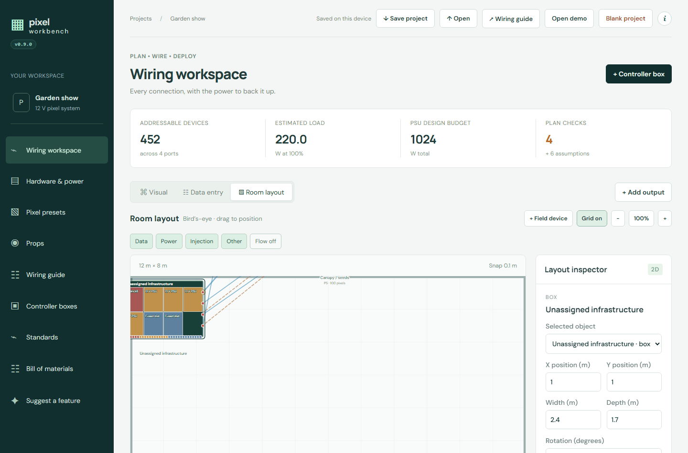</a> 

All shots: [workspace](v0.9.0/01-workspace.png) · [hardware](v0.9.0/02-hardware.png) · [presets](v0.9.0/03-presets.png) · [props](v0.9.0/04-props.png) · [guide](v0.9.0/05-guide.png) · [boxes](v0.9.0/06-boxes.png) · [standards](v0.9.0/07-standards.png) · [bom](v0.9.0/08-bom.png) · [suggest](v0.9.0/09-suggest.png) · [info arch](v0.9.0/info-arch.png) · [info how](v0.9.0/info-how.png) · [info keys](v0.9.0/info-keys.png) · [info new](v0.9.0/info-new.png) · [mobile](v0.9.0/mobile.png)

## [v0.8.0](v0.8.0/)

02/10/2026 · [commit 4da7681](https://github.com/connorturansky-svg/pixel-workbench/commit/4da7681a18b91d859ff9d7f8decfc8a8d0a2f315) · [issue #1](https://github.com/connorturansky-svg/pixel-workbench/issues/1)

> The Suggest a feature page now shows the total number of requests beside the build-status heading. The total updates whenever the request list loads or refreshes. (suggested in #1)

 <a href="v0.8.0/mobile.png">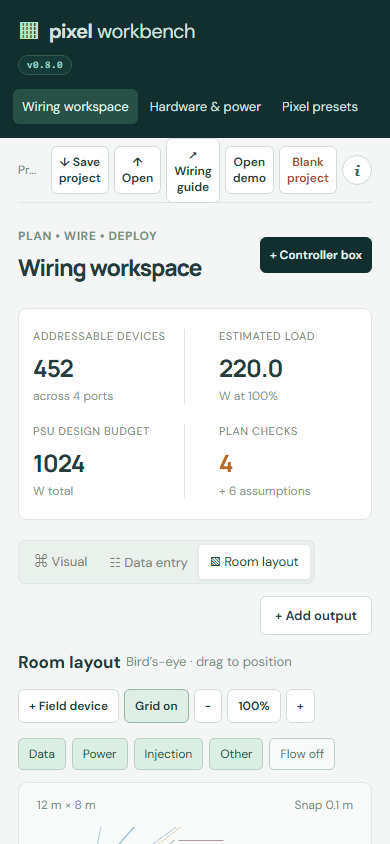</a>

All shots: [workspace](v0.8.0/01-workspace.png) · [hardware](v0.8.0/02-hardware.png) · [presets](v0.8.0/03-presets.png) · [props](v0.8.0/04-props.png) · [guide](v0.8.0/05-guide.png) · [boxes](v0.8.0/06-boxes.png) · [standards](v0.8.0/07-standards.png) · [bom](v0.8.0/08-bom.png) · [suggest](v0.8.0/09-suggest.png) · [info arch](v0.8.0/info-arch.png) · [info how](v0.8.0/info-how.png) · [info keys](v0.8.0/info-keys.png) · [info new](v0.8.0/info-new.png) · [mobile](v0.8.0/mobile.png)

## [v0.7.0](v0.7.0/)

02/10/2026 · [commit 29c699d](https://github.com/connorturansky-svg/pixel-workbench/commit/29c699d2ec5c1eeaaa7d975d085df717eaea1fea)

> New Suggest a feature page in the sidebar. Describe an idea and add screenshots (paste, drop or choose files). The issue title is taken from your first sentence. It opens a GitHub issue under your own account.

 

All shots: [workspace](v0.7.0/01-workspace.png) · [hardware](v0.7.0/02-hardware.png) · [presets](v0.7.0/03-presets.png) · [props](v0.7.0/04-props.png) · [guide](v0.7.0/05-guide.png) · [boxes](v0.7.0/06-boxes.png) · [standards](v0.7.0/07-standards.png) · [bom](v0.7.0/08-bom.png) · [suggest](v0.7.0/09-suggest.png) · [info arch](v0.7.0/info-arch.png) · [info how](v0.7.0/info-how.png) · [info keys](v0.7.0/info-keys.png) · [info new](v0.7.0/info-new.png) · [mobile](v0.7.0/mobile.png)

## [v0.6.2](v0.6.2/)

02/10/2026 · [commit e83ff3d](https://github.com/connorturansky-svg/pixel-workbench/commit/e83ff3da20ec2d50d9cd774f501a07c45b110e14)

> Added a small version badge under the Pixel Workbench logo. Select it to open What’s new. It replaces the version label at the bottom of the sidebar.

<a href="v0.6.2/01-workspace.png">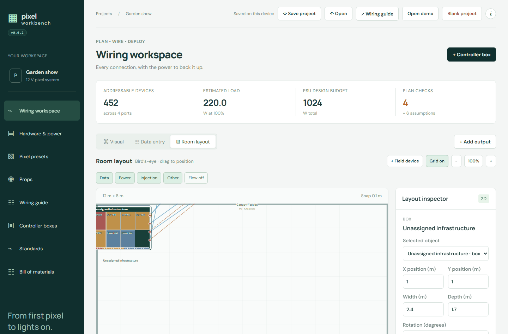</a> 

All shots: [workspace](v0.6.2/01-workspace.png) · [hardware](v0.6.2/02-hardware.png) · [presets](v0.6.2/03-presets.png) · [props](v0.6.2/04-props.png) · [guide](v0.6.2/05-guide.png) · [boxes](v0.6.2/06-boxes.png) · [standards](v0.6.2/07-standards.png) · [bom](v0.6.2/08-bom.png) · [info arch](v0.6.2/info-arch.png) · [info how](v0.6.2/info-how.png) · [info keys](v0.6.2/info-keys.png) · [info new](v0.6.2/info-new.png) · [mobile](v0.6.2/mobile.png)

## [v0.6.1](v0.6.1/)

02/10/2026 · [commit cb0c271](https://github.com/connorturansky-svg/pixel-workbench/commit/cb0c2719c29796e0999cba0ba7330bcb10159379)

> Fixed the page failing to load after an update when the browser still held cached copies of older files. Every script and stylesheet is now versioned, so each release loads as one consistent set.

**Screenshots failed:** smoke test failed before any screenshot: ython312\Lib\site-packages\playwright\_impl\_connection.py", line 559, in wrap_api_call
    raise rewrite_error(error, f"{parsed_st['apiName']}: {error}") from None
playwright._impl._errors.TimeoutError: Page.text_content: Timeout 30000ms exceeded.
Call log:
  - waiting for locator(".brand-version")

## [v0.6.0](v0.6.0/)

02/10/2026 · [commit 38cf66b](https://github.com/connorturansky-svg/pixel-workbench/commit/38cf66b0d2a49f779111c9f7a49af52e0170fa80)

> Info / Help moves from the sidebar into a single i button (top bar) that opens a fixed-size dialog with How to use, What’s new, Architecture and Shortcuts tabs.

**Screenshots failed:** smoke test failed before any screenshot: ython312\Lib\site-packages\playwright\_impl\_connection.py", line 559, in wrap_api_call
    raise rewrite_error(error, f"{parsed_st['apiName']}: {error}") from None
playwright._impl._errors.TimeoutError: Page.text_content: Timeout 30000ms exceeded.
Call log:
  - waiting for locator(".brand-version")

